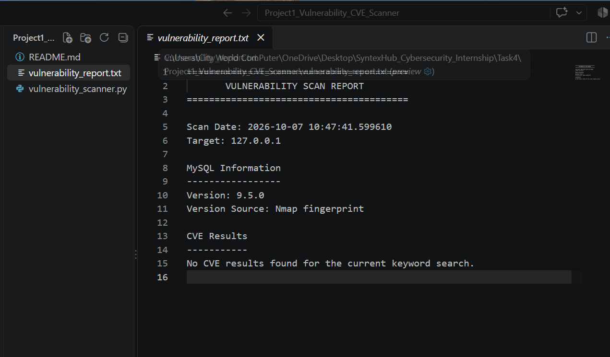

# Project 1 — Vulnerability & CVE Scanner

## Overview

This project is a Python-based vulnerability scanner that uses **Nmap** to scan a target system, identify open ports and services, detect software versions, and check the detected software for known CVEs using the **NVD API**.

For testing, the scanner was run against the local system (`127.0.0.1`).

## Features

- Target IP/hostname input
- Nmap-based network scanning
- Open port detection
- Service detection
- Software version detection
- MySQL version detection from Nmap fingerprint data
- CVE lookup using the NVD API
- CVE description and CVSS information
- Automatic vulnerability report generation

## Technologies Used

- Python 3.12.6
- Nmap 7.991
- NVD CVE API
- Requests library

## Project Structure

Project1_Vulnerability_CVE_Scanner/
│
├── vulnerability_scanner.py
├── vulnerability_report.txt
├── vulnerability_scan_report.png
└── README.md

## How It Works

    Target IP/Hostname
            ↓
       Nmap Scan
            ↓
      Open Port Detection
            ↓
      Service Detection
            ↓
      Version Detection
            ↓
      CVE Lookup using NVD API
            ↓
       Vulnerability Report

## Installation

Make sure Python and Nmap are installed on the system.

Install the required Python library:

    pip install requests

Verify Nmap installation:

    nmap --version

## Usage

Run the scanner:

    python vulnerability_scanner.py

Enter the target IP or hostname when prompted.

Example:

    Enter target IP/hostname: 127.0.0.1

## Test Results

The scanner was tested against:

    Target: 127.0.0.1

Nmap detected the following open ports:

    135/tcp  - Microsoft Windows RPC
    445/tcp  - Microsoft-DS
    2869/tcp - HTTP / Microsoft HTTPAPI
    3306/tcp - MySQL

The MySQL service version was detected from the Nmap fingerprint:

    MySQL 9.5.0

Version source:

    Nmap fingerprint

The scanner then performed a CVE lookup for MySQL 9.5.0 using the NVD API.

Result:

    No CVE results found for the current keyword search.

## Project Output

The scanner successfully generated an automated vulnerability report containing the target information, detected MySQL version, version detection source, and CVE lookup result.

## Important Note

"No CVE results found for the current keyword search" means that the NVD keyword search did not return matching results. It does not mean that the software has no vulnerabilities.

## Learning Outcome

Through this project, I practiced:

- Python subprocess usage
- Running Nmap from Python
- Network/service scanning
- Software version detection
- Working with regular expressions
- Using REST APIs
- Retrieving CVE information
- Basic vulnerability assessment concepts
- Generating automated security reports

## Disclaimer

This project is intended for educational and authorized security testing only.

Only scan systems that you own or have explicit permission to test.